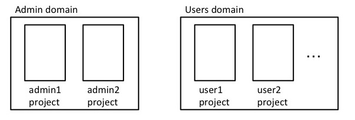

# Operation as Code

この記事は [OpenStack advent calender 2016 12/23](http://www.adventar.org/calendars/1739) に投稿している記事です。

最近は DevOps の流行でオペレータもコードを書いたり、Ansible などの構成管理ツールを利用した Infrastructure as Code として、インフラの情報もコードで操作や管理するようになってきました。
今回は OpenStack のポリシー管理プロジェクトである Congress を利用して、オペレーションを Code 化する Operation as Code を紹介したいと思います。

## Congress

Congress プロジェクトをご存知でない方も多いかと思いますので、始めに Congress プロジェクト自体の簡単な説明をしたいと思います。
もう知ってるよ! という方は、サッと飛ばしてもらって結構です。

[Congress](https://wiki.openstack.org/wiki/Congress) は OpenStack の BigTent の一つで、クラウド環境があるべき状態になっているか情報を収集し、検査と修正を行い、クラウド環境に Governance を持たせる事を目的としてプロジェクトです。
そのため、Congress は Govanance as a Service と呼ばれています。

**Govanance** と言うと難しく聞こえてしまいますが、要はクラウドを利用したり運用したりする時の各種ポリシーを Congress に設定すると、Congress が設定したポリシーに従ってクラウドが運用をしてくれます。
例えば、「インターネットに接続している仮想マシンが 80 番ポートで通信してはいけない」というセキュリティポリシーが存在したとします。
このポリシーが OpenStack 上のインスタンスで満たされているかを確認するには、Nova や Neutron などプロジェクトを跨いでクラウド内の情報を確認しなければなりません。
対して、Congress に上記のセキュリティポリシーを設定しておくと、Nova や Neutron の情報を収集、検査をして、必要であればセキュリティポリシー違反の修正も Congress が実施します。

「ポリシー」と一言でまとめても会計、セキュリティや開発部門など組織によって思い描くものが異なります。Congress は特定のポリシーではなく全てのポリシーを扱えるようになることを目標としています。

### Congress のポリシー言語

Congress に設定するポリシーは [Datalog](https://en.wikipedia.org/wiki/Datalog) を利用しています。
Datalog は Prolog のサブセット言語ですので、なんとなく読める方も多いかと思います。

また、Datalog はパッと見ですととっつきにくいかもしれませんが、SQL 文に近い考え方で記述することができます。
感覚的には、 Congress がクラウドから収集した各種の情報の中から、SQL 文で必要となる情報を取り出すイメージでしょうか。
この記事を見ている方で、今まで DB にクエリを投げた事がない人は少ないと思いますので、結構簡単に記述できます。

ポリシーのサンプルとして、 **flavor が "c2" の VM インスタンスが繋がっている neutron network の ID** を見つけるポリシーを書いてみましょう。

```
# sample policy rule

networks_connected_by_c2_instance(net_id):-         # networks_connected_by_c2_instance というテーブルを定義、カラムは net_id
    nova:servers(id=instance_id, flavor_id="c2"),   # flavor_id = c2 のインスタンス id を instance_id として取得
    neutronv2:ports(device_id=instance_id, network_id=net_id) # device_owner が instance_id となっているポートの network_id を net_id へ設定
```

上記の内容を SQL で書くとしたら下記の様な感じになります。(あくまでイメージです。)

```
select neutronv2.ports.network_id 
    from nova.servers join neutronv2.ports
        on nova.servers.id=neutronv2.ports.device_id
    where nova.servers.flavor="c2";
```

なお、同一のポリシー名を複数回定義すると、それぞれのポリシーで取得した内容を結合した結果が取得できます。
例えば、 **network の名前が "global-network" に直接繋がっている VM の flavor は、"c2" または "c3" 以外を使わないといけない** といったポリシーがあったとします。
この場合には、global-network に接続している c2 または c3 を利用した VM を見つける事でポリシー違反をしている VM を確認できます。
ポリシー違反をしている VM を invalid_vms というテーブルに定義するには、次の様に Congress のポリシーを 2 つ定義することで記述できます。

```
# flavor_id が c2 かつ global-network に接続している VM の id を取得
invalid_vms(instance_id):-
    nova:servers(id=instance_id, flavor_id="c2"),
    neutronv2:ports(device_owner=instance_id, network_id=net_id),
    neutronv2:networks(id=net_id, name="global-network")

# flavor_id が c3 かつ global-network に接続している VM の id を取得
invalid_vms(instance_id):-
    nova:servers(id=instance_id, flavor_id="c3"),
    neutronv2:ports(device_owner=instance_id, network_id=net_id),
    neutronv2:networks(id=net_id, name="global-network")
```

簡単ですが、Congress のポリシーの説明は以上です。
これから本題の運用ポリシーのコード化を説明したいと思います。

## 運用ポリシーのコード化

Operation as Code が題材なので、クラウドの運用ポリシーを Congress のポリシーで記述してコード化していきます。
今回は簡単に、「メンテナンス対象の Compute node には、ユーザの Nova インスタンスが存在しない」というポリシーを as Code で実現していきましょう。
Compute node のメンテナンス中に、間違ってユーザの Nova インスタンスが動作したまま、Compute node の電源を落としてしまわないようにするための運用 ポリシーです。

### 前提

今回のポリシーを書くにあたり、ユーザ用の keystone の project は "Users" domain にあり、admin の project は "Admin" domain にあるとします。

Users domain と Admin domain の関係はこんな感じになっている想定です。


### メンテナンス対象の Compute node から自動マイグレーション

まずはじめにメンテナンス中の Compute node と、その上で動いているユーザ VM のインスタンスを特定するポリシーです。

```
user_instances_on_maintenance(instance_id):-
    nova:servers(id=instance_id, host_name=host, tenant_id=tenant_id),
    nova:services(binary="nova-compute", host=host, status="disable"),
    keystonev3:projects(id=tenant_id, domain_id=domain),
    keystonev3:domains(id=domain, name="Users")
```

こちらのポリシーを詳しく説明しましょう。

```
    nova:servers(id=instance_id, host_name=host, tenant_id=tenant_id),
    nova:services(binary="nova-compute", host=host, status="disable"),
```

前半の部分で status が disable になっている compute node 上で動作する VM の一覧を取得しています。
また、それらの VM が所属する project の id を tenant_id に設定しています。

```
    keystonev3:projects(id=tenant_id, domain_id=domain),
    keystonev3:domains(id=domain, name="Users")
```

後半の部分では "Users" という名前の domain に所属している project の一覧を取得しています。
こちらでも同様に Users に所属している project の id を tenant_id に設定しています。

前半と後半を合わせると、それぞれの条件が AND で結合されるので tenant_id で関連付けが行われ、
**status が disable になっている compute node 上で動作しており、かつ Users domain に所属している VM の id 一覧** が取得できます。

次は上で取得したユーザのインスタンスに対して、マイグレーションをして別ホストに移動させてあげましょう。

```
# 起動中のインスタンスは live migration で別ホストへ移動
execute[nova:servers.live_migrate(id)]:-
    user_instances_on_maintenance(id),
    nova:servers(id=id, status="ACTIVE")

# 停止中のインスタンスは migration で別ホストへ移動
execute[nova:servers.migrate(id)]:-
    user_instances_on_maintenance(id),
    nova:servers(id=id, status="STOPPED")
```

execute なる文言が初めて出てきましたが、こちらはそれぞれのポリシーに該当した内容に対して、Congress が実施するアクションを記載しています。
`execute[nova:servers.live_migrate(id)]` では、id 部分に該当する内容に対して live_migrate を実行する。というアクションの記述です。
```
    user_instances_on_maintenance(id),
    nova:servers(id=id, status="ACTIVE")
```
ここで、先程のポリシーで取得した status が disable の compute host 上で動いている Users domain に所属しており、かつ status が ACTIVE である VM インスタンスの一覧を取得しています。
この VM の一覧に対して、live_migrate を実行せよ。というのが、このポリシーです。
また、Nova では status が STTOPED の時には live_migrate ではなく migrate を実行する必要があるので、migrate 用のポリシーも合わせて記載しています。

以上の様に 「メンテナンス対象の Compute node にはユーザの Nova インスタンスが存在しない」と言う運用ポリシーを実現するためには、3 つほどポリシーを Congress に設定しておくだけで、
あとは自動でポリシーに合わせた運用を実施してくれるようになります。

## まとめ

Operation as Code として、運用ポリシーをコード化して OpenStack の運用を実施する方法を紹介しました。
ありがちなのは、クラウドの運用ポリシーが「チェックシート」とかになっており、人手でのチェックが必要になっていないでしょうか。
Congress を使えば運用ポリシーを as Code で提供する事ができるので、人手でのチェックシート運用もなくしていくことができます。

というわけで、ぜひみなさん運用に限らず Congress を使って行きましょう。
Congress 便利ですよ。Congress。